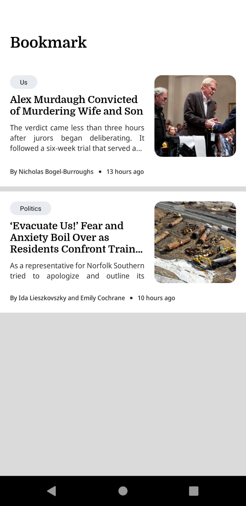

# NYT-Android-Clone

An Android app for nyt Articles made using NYT API

About app:

- Architecture
  - MVVM Architecture
  - Repository pattern

- Jetpack
  - Lifecycle - dispose of observing data when lifecycle state changes.
  - ViewModel - UI related data holder, lifecycle aware.
  - Room Persistence.

ScreenShots

